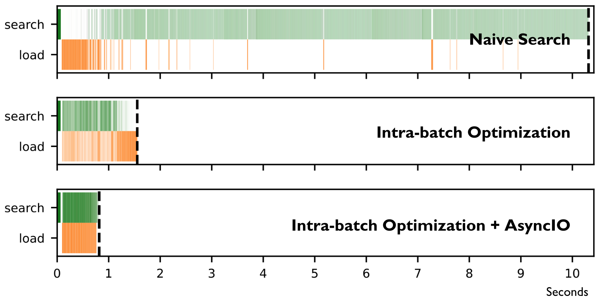

# Efficient Serving of Large-scale Vector Search with Sharded Indexes

A prototype system built on top of Faiss for efficient vector search on large datasets with sharded indexes.

<!-- <p align="center">
   -->
# 

## Setup
```
pip install -r requirements.txt
```

## Generate synthetic index shards
```
mkdir shards

python create_shard_idx.py
```

## Querying sharded indexes
```
python query_shard_idx.py
```
